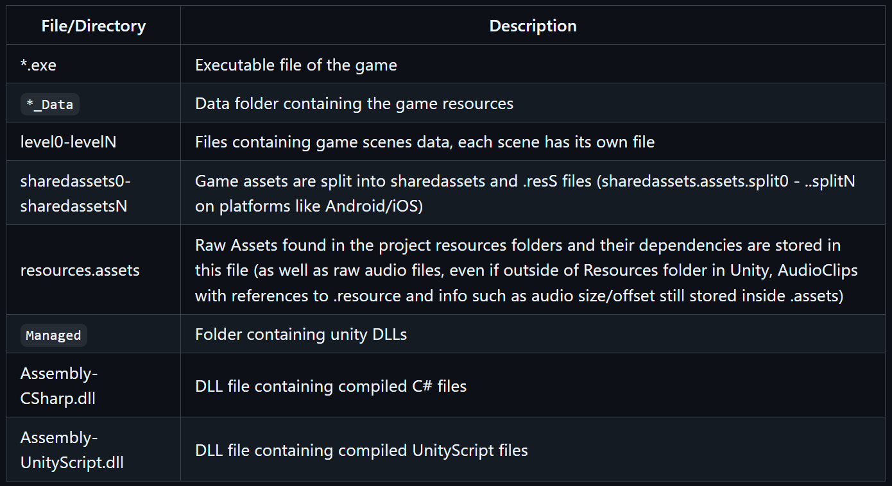
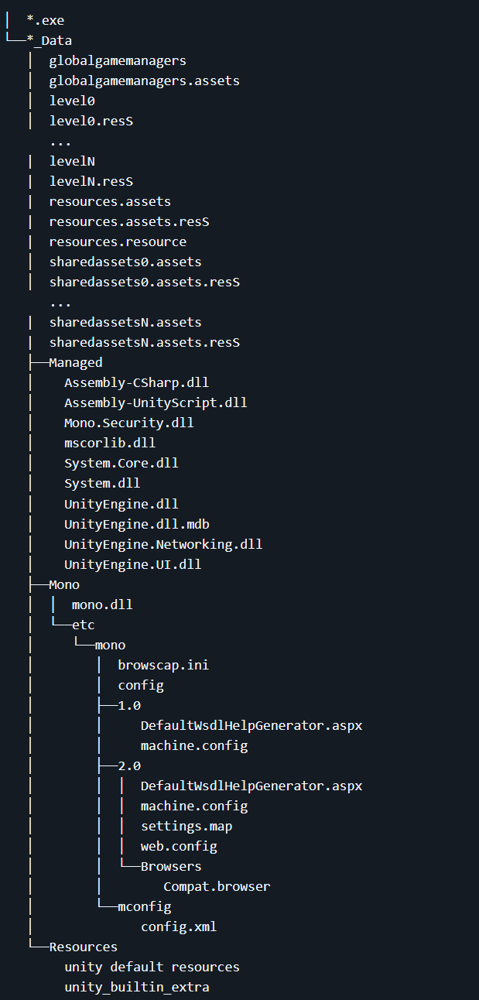
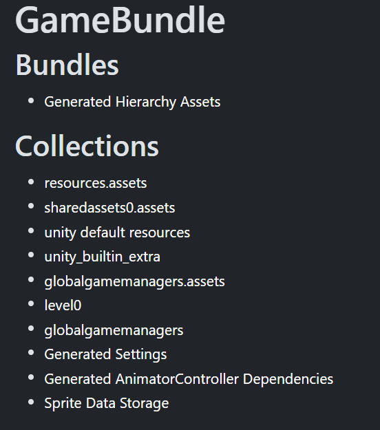
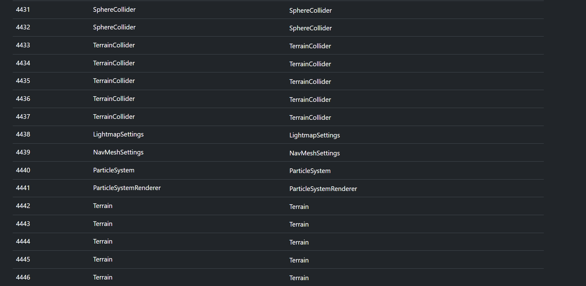

# FlightRisk

## Method

Upon running the game we first see that the flag is at the end of the map that we have to fly through.

We control using wasd or whatever the usual. Now continuing our way towards the the supposed end we can see that there are tall spikes that we collide with (can fly around), there is also missiles ;-;
These are basically unavoidable as they seem to be seeking. There seems to be no work arounds by flying under the map over it or below it.

My first idea was to hack the game which is of Unity. I first try searching unity game hacking.

i find a very cool github that gives me all the tools etc [Hacking Unity Games](https://github.com/imadr/Unity-game-hacking)

Upon looking at it 

We see that it is similar to the game folder provided to us hence we understand that we need to hack it.

Looking back earlier at the unity game folder structure we can see that assets comes under data and this is most likely what we need to edit.

Upon going through the tools provided for ``Extracting Assets``

I first start using the normal ``AssetRipper`` [Asset Ripper](https://github.com/user/repo/blob/main/docs/file.md)

Upon opening it and pushing the entire ``flightrisk_Data`` file to it we can see that theres quite a few assets.

Now investigating each one I was able to see alot of stuff, i was quickly able to see that in the ``level0`` file we have some assets called *EnemySpawn* and that 5 of them exist. 

I'll assume this is what spawns the missiles. However one oversight I am unable to edit these assets out from using Asset Ripper so i try using the next Asset tool they gave us in the document [UABE](https://github.com/SeriousCache/UABE) however we cannot use this as it does not also let us edit these files and come to realise it has not been updated in nearly 2 years.

After looking around for unity asset bundle extractor i also tried looking for an editor. to which i was lucky to find
[UABEA](https://github.com/nesrak1/UABEA).

From here i can just enter the ``level0`` file into it and now it gives me an option to navigate through the assets with the same order as we saw from earlier. Now i just delete enemyspawn locations wherever it was mentioned in our first asset ripper.

This was easy to navigate as i could just use the path id to find it.

Now from here i saved the file and retried the game.

Upon doing this we see no missiles spawn but seem to come across a large number of spikes / terrain that has no gaps even for expert pilots to get through ;-;

From here i go back to looking at the assets. 
Essentially at the end of unity asset files we can find other assets or unity structures (taken online)

Scrolling to the bottom of my asset ripper stuff we finally see what is making a terrain (map), and some other stuff 

from here i can see *TerrainCollider* and *SphreCollider*

Again i can just remove these.

After doing this and retrying the game i am able to fly through the spikes without losing health. doing this for a minute i see a city finally to which at the end of it i see the flag.

## Flag

> nite{ggwp_Maver1ck}